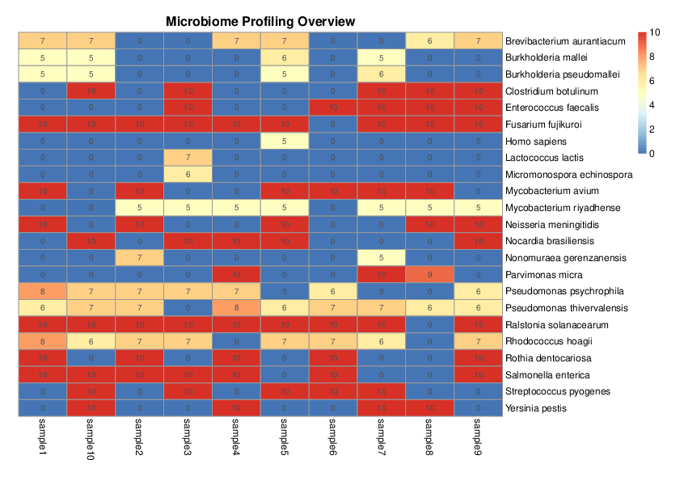
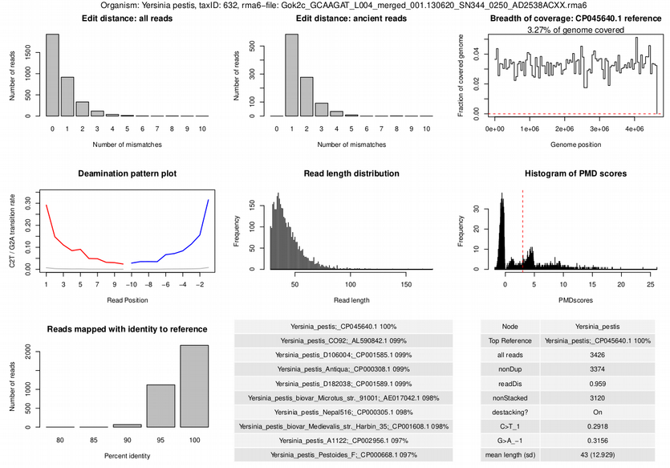
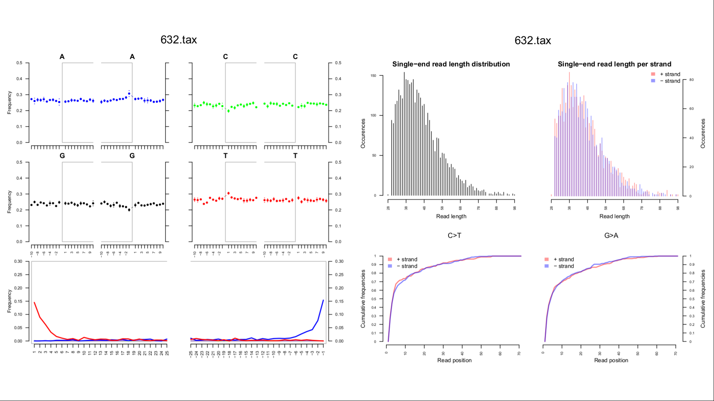
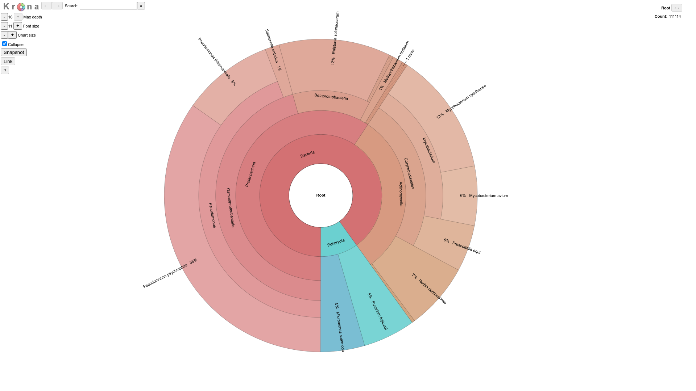
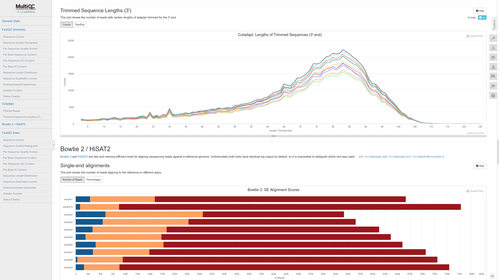

# aMeta: an accurate and memory-efficient ancient Metagenomic profiling workflow

## About

aMeta is a Snakemake workflow for identifying microbial sequences in ancient DNA shotgun metagenomics samples. The workflow performs:

- trimming adapter sequences and removing reads shorter than 30 bp with Cutadapt
- quaity control before and after trimming with FastQC and MultiQC
- taxonomic sequence kmer-based classification with KrakenUniq
- sequence alignment with Bowtie2 and screening for common microbial pathogens
- deamination pattern analysis with MapDamage2
- Lowest Common Ancestor (LCA) sequence alignment with Malt
- authentication and validation of identified microbial species with MaltExtract

When using aMeta and / or pre-built databases provided together with the wokflow for your research projects, please cite our preprint: https://www.biorxiv.org/content/10.1101/2022.10.03.510579v1

## Authors

* Nikolay Oskolkov (@LeandroRitter) nikolay.oskolkov@scilifelab.se
* Claudio Mirabello (@clami66) claudio.mirabello@scilifelab.se
* Per Unneberg (@percyfal) per.unneberg@scilifelab.se

## Installation

Clone the github repository, then create and activate aMeta conda environment (here and below `cd aMeta` implies navigating to the cloned root aMeta directory). For this purpose, we recommend installing own `conda`, for example from here https://docs.conda.io/en/latest/miniconda.html, and `mamba` https://mamba.readthedocs.io/en/latest/installation.html:

    git clone https://github.com/NBISweden/aMeta
    cd aMeta
    mamba env create -f workflow/envs/environment.yaml
    # alternatively: conda env create -f workflow/envs/environment.yaml, however it takes longer
    conda activate aMeta

Run a test to make sure that the workflow was installed correctly:

    cd .test
    ./runtest.sh -j 4

Here, and below, by `-j` you can specify the number of threads that the workflow can use. Please make sure that the installation and test run accomplished successfully before proceeding with running aMeta on your data. Potential problems with installation and test run often come from unstable internet connection and particular `conda` settings used e.g. at computer clusters, therefore we advise you to use your own freshly installed `conda`.

## Quick start

To run the worflow you need to prepare a tab-delimited sample-file `config/samples.tsv` with at least two columns, and a configuration file `config/config.yaml`, below we provide examples for both files. 

Here is an example of `samples.tsv`, this implies that the fastq-files are located in `aMeta/data` folder:

    sample	fastq
    foo	data/foo.fq.gz
    bar	data/bar.fq.gz

Currently, it is important that the sample names in the first column exactly match the names of the fastq-files in the second column. For example, a fastq-file "data/foo.fq.gz" specified in the "fastq" column, must have a name "foo" in the "sample" column. 
Please make sure that the names in the first and second columns match.

Below is an example of `config.yaml`, here you will need to download a few databases that we made public (or build databases yourself).

    samplesheet: "config/samples.tsv"

    # KrakenUniq Microbial NCBI NT database (if you are interested in prokaryotes only)
    # can be downloaded from https://doi.org/10.17044/scilifelab.20518251
    krakenuniq_db: resources/DBDIR_KrakenUniq_MicrobialNT

    # KrakenUniq full NCBI NT database (if you are interested in prokaryotes and eukaryotes)
    # can be downloaded from https://doi.org/10.17044/scilifelab.20205504
    #krakenuniq_db: resources/DBDIR_KrakenUniq_Full_NT

    # Bowtie2 index and helping files for following up microbial pathogens 
    # can be downloaded from https://doi.org/10.17044/scilifelab.21185887
    bowtie2_db: resources/library.pathogen.fna
    bowtie2_seqid2taxid_db: resources/seqid2taxid.pathogen.map
    pathogenomesFound: resources/pathogensFound.very_inclusive.tab

    # Bowtie2 index for full NCBI NT (for quick followup of prokaryotes and eukaryotes),
    # can be downloaded from https://doi.org/10.17044/scilifelab.21070063 (please unzip files)
    # For using Bowtie2 NT index, replace "bowtie2_db" and "bowtie2_seqid2taxid_db" above by
    #bowtie2_db: resources/library.fna
    #bowtie2_seqid2taxid_db: resources/seqid2taxid.map.orig

    # Helping files for building Malt database 
    # can be downloaded from https://doi.org/10.17044/scilifelab.21070063
    malt_nt_fasta: resources/library.fna
    malt_seqid2taxid_db: resources/seqid2taxid.map.orig
    malt_accession2taxid: resources/nucl_gb.accession2taxid

    # A path for downloading NCBI taxonomy files (performed automatically)
    # you do not need to change this line
    ncbi_db: resources/ncbi

    # Breadth and depth of coverage filters 
    # default thresholds are very conservative, can be tuned by users
    n_unique_kmers: 1000
    n_tax_reads: 200

There are several ways to download the database files. One is to follow this link https://docs.figshare.com/#articles_search and search for the last number in the database links provided above in the "article_id" search bar. This will give you the download url for each file. Then you can either use wget inside a screen session or tmux session to download it, or aria2c, for example, https://aria2.github.io/ .

After you have prepared the sample- and configration-file, please install job-specific environments and update Krona taxonomy:

    cd aMeta
    snakemake --snakefile workflow/Snakefile --use-conda --conda-create-envs-only -j 20
    env=$(grep krona .snakemake/conda/*yaml | awk '{print $1}' | sed -e "s/.yaml://g" | head -1)
    cd $env/opt/krona/
    ./updateTaxonomy.sh taxonomy
    cd -

Finally, the workflow can be run using the following command line:

    cd aMeta
    snakemake --snakefile workflow/Snakefile --use-conda -j 20

In the sections **More configuration options**, **Environment module configuration** and **Runtime configuration** we will give more information about fine-tuning the configuration as well as instructions on how to run the workflow in a computer cluster enviroment.

## Main results of the workflow and their interpretation

All output files of the workflow are located in `aMeta/results` directory. To get a quick overview of ancient microbes present in your samples you should check a heatmap in `results/overview_heatmap_scores.pdf`.

The heatmap demonstrates microbial species (in rows) authenticated for each sample (in columns). The colors and the numbers in the heatmap represent authentications scores, i.e. numeric quantification of seven quality metrics that provide information about microbial presence and ancient status. The authentication scores can vary from 0 to 10, the higher is the score the more likely that a microbe is present in a sample and is ancient. Typically, scores from 8 to 10 (red color in the heatmap) provide good confidence of ancient microbial presence in a sample. Scores from 5 to 7 (yellow and orange colors in the heatmap) can imply that either: a) a microbe is present but not ancient, i.e. modern contaminant, or b) a microbe is ancient (the reads are damaged) but was perhaps aligned to a wrong reference, i.e. it is not the microbe you think about. The former is a more common case scenario. The latter often happens when an ancient microbe is correctly detected on a genus level but we are not confident about the exact species, and might be aligning the damaged reads to a non-optimal reference which leads to a lot of mismatches or poor evennes of coverage. Scores from 0 to 4 (blue color in the heatmap) typically mean that we have very little statistical evedence (very few reads) to claim presence of a microbe in a sample.

To visually examine the seven quality metrics 

1. deamination profile, 
2. evenness of coverage, 
3. edit distance (amount of mismatches) for all reads, 
4 .edit distance (amount of mismatches) for damaged reads, 
5. read length distribution, 
6. PMD scores distribution, 
7. number of assigned reads (depth of coverage), 

corresponding to the numbers and colors of the heatmap, one can find them in `results/AUTHENTICATION/sampleID/taxID/authentic_Sample_sampleID.trimmed.rma6_TaxID_taxID.pdf` for each sample `sampleID` and each authenticated microbe `taxID`. An example of such quality metrics is shown below:

In case you are interested in an overview of microbial species present in your samples **irrespective of their ancient status**, you can simply check a KrakenUniq abundance matrix here `results/KRAKENUNIQ_ABUNDANCE_MATRIX/krakenuniq_absolute_abundance_heatmap.pdf`:

The values in the heatmap above indicate the numbers of reads assigned to each microbe in each species. The corresponding Total Sum Scaled (TSS), aka library size normalized, KrakenUniq abundance matrix is located in `results/KRAKENUNIQ_ABUNDANCE_MATRIX/krakenuniq_normalized_abundance_heatmap.pdf`. Please note that the microbial species in the KarkenUniq abundance matrix might not always overlap with the ones present in the authentication score heatmap above. This is because not all microbes detected by KrakenUniq at the pre-screening step can be successfully validated by Malt + MaltExtract.

Finally, below we list locations and provide short comments for a few other useful metrics / plots / information delivered by aMeta which you perhaps would also like to check:

- the deamination profile computed by MaltExtract among the seven validation and authentication metrics above might be less informative than the one delivered by MapDamage. You can find the deamination profile for the microbe of interest with `taxID` detected in sample `sampleID` here `results/MAPDAMAGE/sampleID/taxID.tax.bam/Fragmisincorporation_plot.pdf`. Please note that the MapDamage deamination profile is computed on Bowtie2 alignments without LCA, these alignments might be less accurate than the LCA-based Malt alignments used for MaltExtract.

- visualization of KrakenUniq microbial detection results for each sample `sampleID` is available at `results/KRAKENUNIQ/sampleID/taxonomy.krona.html`.

- unfiltered KrakenUniq results for each sample `sampleID` can be found in `results/KRAKENUNIQ/sampleID/krakenuniq.output`, filtered with `n_unique_kmers` (breadth of coverage) and `n_tax_reads` (depth of coverage) can be found in `results/KRAKENUNIQ/sampleID/krakenuniq.output.filtered`, and the pathogenic subset of the filtered KrakenUniq results for each sample `sampleID` is available in `results/KRAKENUNIQ/sampleID/krakenuniq.output.pathogens`.
- Malt microbial abundance matrix quantified from rma6- and sam-files can be found in `results/MALT_ABUNDANCE_MATRIX_RMA6/malt_abundance_matrix_rma6.txt` and `results/MALT_ABUNDANCE_MATRIX_SAM/malt_abundance_matrix_sam.txt`, respectively. These abundance matrices are complementary and can be compared with the KrakenUniq abundance matrix from `results/KRAKENUNIQ_ABUNDANCE_MATRIX/krakenuniq_abundance_matrix.txt` for a better intuition about microbial presence and abundance.
- all technical details on the quality of your data, adapter trimming, alignments etc. can be found in `results/MULTIQC/multiqc_report.html`.

## More configuration options

Within `config.yaml` one can specify what samples to analyse in the `samples` section through the `include` and `exclude` keys, so that a global samplesheet can be reused multiple times.

Analyses `mapdamage`, `authentication`, `malt`, and `krona` can be individually turned on and off in the `analyses` section.

Adapter sequences can be defined in the `adapters` section of `config.yaml`. 
The keys `config['adapters']['illumina']` (default `true`) and `config['adapters']['nextera']` (default `false`) are switches
that turn on/off adapter trimming of illumina (`AGATCGGAAGAG`) and nextera (`AGATCGGAAGAG`) adapter sequences. Addional custom adapter sequences can be set in the configuration key
`config['adapters']['custom']` which must be an array of strings.

An example snippet that can optionally be added to the configuration file `config.yaml` is shown below:

    # you can include or exclude samples
    samples:
      include:
        - foo
      exclude:
        - bar

    # you can include or exclude certain types of analysis
    analyses:
      mapdamage: true
      authentication: true
      malt: true
      krona: true

    # you can specify type of adapters to trim
    adapters:
      illumina: true
      nextera: false
      # custom is a list of adapter sequences
      custom: []

## Environment module configuration

To run the workflow in a computer cluster environemnt you should specify environmental modules and runtimes via `--profile` as follows:

    snakemake --snakefile workflow/Snakefile -j 100 --profile .profile --use-envmodules

If the workflow is run on a HPC with the `--use-envmodules` option
(see
[using-environment-modules](https://snakemake.readthedocs.io/en/stable/snakefiles/deployment.html#using-environment-modules)),
the workflow will check for an additional file that configures environment modules. By default, the file is `config/envmodules.yaml`, but a custom location can be set with the
environment variable `ANCIENT_MICROBIOME_ENVMODULES`.

Environmental modules configurations are placed in a configuration section
`envmodules` with key-value pairs that map a dependency set to a list
of environment modules. The dependency sets are named after the rule's
corresponding conda environment file, such that a dependency set may
affect multiple rules. For instance, the following example shows how
to define modules for rules depending on fastqc, as it would be
implemented on the [uppmax](https://uppmax.uu.se/) compute cluster:

    envmodules:
      fastqc:
        - bioinfo-tools
        - FastQC

See the configuration schema file
(`workflows/schema/config.schema.yaml`) for more information.

## Runtime configuration

Most individual rules define the number of threads to run. Although
the number of threads for a given rule can be tweaked on the command
line via the option `--set-threads`, it is advisable to put all
runtime configurations in a
[profile](https://snakemake.readthedocs.io/en/stable/snakefiles/best_practices.html).
At its simplest, a profile is a directory (e.g. `.profile` in the
working directory) containing a file `config.yaml` which consists of
command line option settings. In addition to customizing threads, it
enables the customization of resources, such as runtime and memory. An
example is shown here:

    # Rerun incomplete jobs
    rerun-incomplete: true
    # Restart jobs once on failure
    restart-times: 1
    # Set threads for mapping and fastqc
    set-threads:
      - Bowtie2_Alignment=10
      - FastQC_BeforeTrimming=5
    # Set resources (runtime in minutes, memory in mb) for malt
    set-resources:
      - Malt:runtime=7200
      - Malt:mem_mb=512000
    # Set defalt resources that apply to all rules
    default-resources:
      - runtime=120
      - mem_mb=16000
      - disk_mb=1000000

For more advanced profiles for different hpc systems, see [Snakemake-Profiles github page](https://github.com/snakemake-profiles).

## Frequently Asked Questions (FAQ)

### My fastq-files do not contain adapters, how can I skip the adapter removal step?

To our experinece, there are very often adapter traces left even after an adapter removing software has been applied to the fastq-files. 
Therefore, we strongly recommend not to skip the adapter removal step. This step is typically not time consuming and can only be beneficial for the analysis.
Otherwise, adapter contamination can lead to severe biases in microbial discovery.

### I have paired-end (PE) sequencing data, does aMeta support it?

Currently not, but this option will be added soon. As in other aDNA analyses, PE reads need to be merged prior to using aMeta, this can be achieve by e.g. `fastp` https://github.com/OpenGene/fastp. Alternatively, simple concatenation of R1 and R2 reads as

        cat R1.fastq.gz R2.fastq.gz > merged.fastq.gz

is also possible, and the resulting file `merged.fastq.gz` can be used as input for aMeta.

### I get "Java heap space error" on the Malt step, what should I do?

You will need to adjust Malt max memory usage (64 GB by default) via modifying `malt-build.vmoptions` and `malt-run.vmoptions` files. 
To locate these files you have to find a Malt conda environment, activate it and replace the default 64 GB with the amount of RAM available on you computer node, in the example below it is 512 GB:

        cd aMeta
        env=$(grep hops .snakemake/conda/*yaml | awk '{print $1}' | sed -e "s/.yaml://g" | head -1)
        conda activate $env
        version=$(conda list malt --json | grep version | sed -e "s/\"//g" | awk '{print $2}')
        cd $env/opt/malt-$version
        sed -i -e "s/-Xmx64G/-Xmx512G/" malt-build.vmoptions
        sed -i -e "s/-Xmx64G/-Xmx512G/" malt-run.vmoptions
        cd -
        conda deactivate

### I get "Java heap space error" on the FastQC step, what should I do?

Similarly to Malt, see above, you will need to modify the default memory usage of FastQC. An example of how this can be done is demonstrated below:

        cd aMeta
        env=$(grep fastqc .snakemake/conda/*yaml | awk '{print $1}' | sed -e "s/.yaml://g" | head -1)
        conda activate $env
        version=$(conda list fastqc --json | grep version | sed -e "s/\"//g" | awk '{print $2}')
        cd $env/opt/fastqc-$version
        sed -i -e "s/-Xmx250m/-Xmx10g/" fastqc
        cd -
        conda deactivate

### I get a "No validator found" message, should I be worried?

Short answer: no, you do not need to be worried about purple snakemake warning text. Only red messages indicate an error and should be investigated.

### aMeta takes a lot of time to run, can I speed it up?

If you run aMeta using our pre-built database:

        KrakenUniq database based on full NCBI NT: https://doi.org/10.17044/scilifelab.20205504
        KrakenUniq database based on microbial part of NCBI NT: https://doi.org/10.17044/scilifelab.20518251
        KrakenUniq database based on microbial part of NCBI RefSeq: https://doi.org/10.17044/scilifelab.21299541
        Bowtie2 index for full NCBI NT database: https://doi.org/10.17044/scilifelab.21070063
        Bowtie2 index for pathogenic microbial species of NCBI NT: https://doi.org/10.17044/scilifelab.21185887

it can be very fast (a few hours for a sample with ~10 mln reads) if you have enough RAM (recommended minimum ~200 GB, ideally ~1 TB). Otherwise, runing aMeta with smaller RAM is also possible but results in much longer computation times. We prioritize using large databases for more accurate metagenomic analysis. Alternatively, smaller databases can also be used which might speed up aMeta considerably, but very likely result in less accurate analysis (lower sensitivity and specificity).

